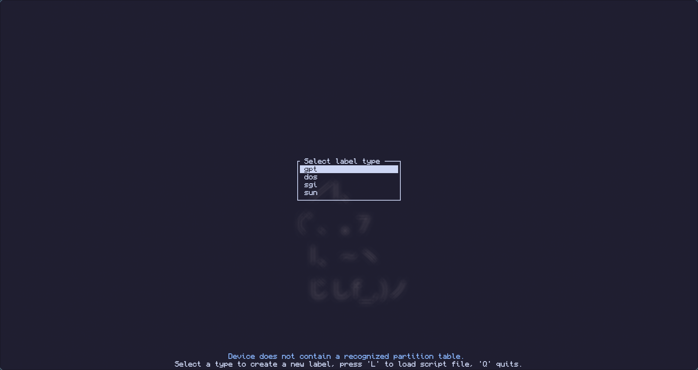
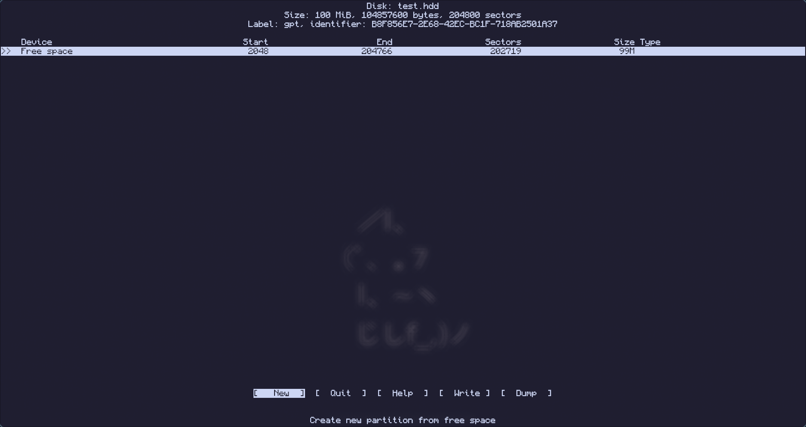
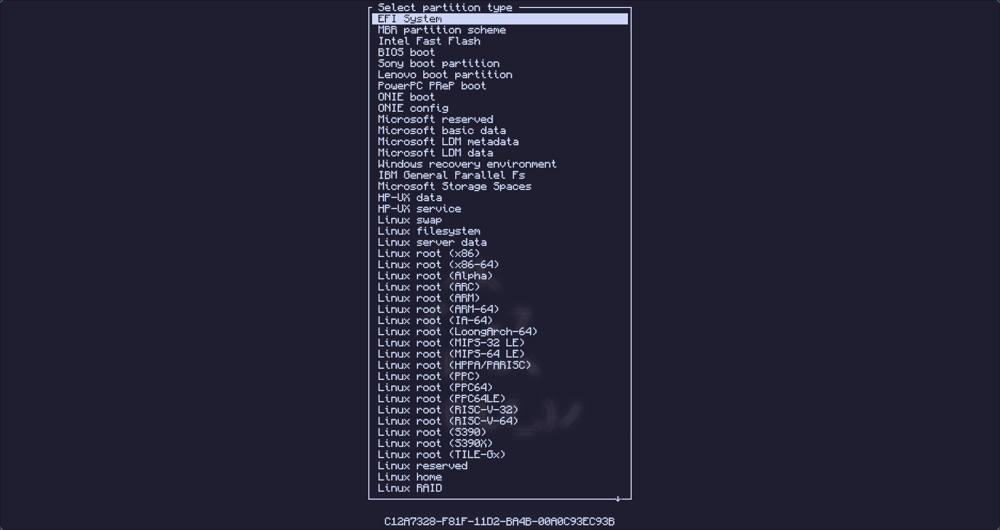

# snake-os

## Setup

The setup script requires the programs `wipefs, sgdisk, mkfs.fat, kpartx`,
check with your distros repos to ensure you have the required packages needed.

To set up the test image run `create_image.sh` to create and/or update the test.hdd image

### USB Setup

The USB setup is manual as it is dangerous to automate such a process, so I will explain how to do it manually.
If you have ever installed a Linux distro manually like Arch Linux this process will sound very familiar to you.

Start by noting what device your USB drive is, this can be done with the command `lsblk`. It should show up as `/dev/sda` or something similar.
As for later on in the tutorial I will assume your drive is `/dev/sda`, but please do make sure that you are using your drive name.

Once you note what device your USB is, we need to partition it. For this I prefer using `cfdisk`, but any partitioning application can work.
To partition in `cfdisk` is as follows, run the command `cfdisk /dev/sda`. This should open up an interface like so:

Select gpt and move onward to the next screen, which should loop like this:

If there are partitions already on the disk you are encouraged to delete them if you do not know what you are doing and are sure you don't have any sensitive data on the USB.

The options on the bottom can be navigated with tab and shift tab. **NOTE THAT YOU WILL WIPE YOUR DRIVE CLEAN DOING THIS.**
Create a new partition, and it should ask you for the size of said partition; it can be however big you want it, but I recommend a minimum size of 33M. Once you create a partition make sure it is selected with the arrow keys and then go change the type with the bottom menu. Upon entering the menu you should see the following:

Select EFI System as seen in the image and then move on to writing the partitions on the bottom options. It will prompt you to type out the word "yes" which you can do if you want to overwrite all the data on said USB.

Once this is completed you may exit the program

You have partitioned the disk now, but it still needs to be formatted with a file system. The UEFI spec states that the EFI System partition be a FAT32 file-system. To do this make we will use the command `mkfs.fat -F32 /dev/sda1`. This command specifically targets the EFI System partition by specifying /dev/sda1. If you partitioned it differently, then substitute as needed. From now on almost all of our commands will be done on the partition.

After formatting the drive, we can mount onto it using `sudo mount /dev/sda1 /mnt`, making sure you have a mnt folder in your root directory. Once this has been completed create the file-structure as follows: /mnt/EFI/BOOT/ using a command like `sudo mkdir -p /mnt/EFI/BOOT`. Then copy the BOOTX64.EFI file, compiled using `make`; this can be done with the following command: `sudo cp BOOTX64 /mnt/EFI/BOOT/BOOTX64.EFI`.

With that we have a bootable USB with the snake OS loaded. Unmount the USB by running `sudo umount /mnt` and boot off the USB, without secure boot. I wouldn't recommend running a random OS without knowing what it does as malware is a concern, but the code is in this repo, so you know exactly how everything works if you want to check it.

## Running

To run the OS, create a USB image and boot off it [found here](#usb-setup) or install qemu and run `qemu.sh`

## Docs

The documentation for the UEFI Specification used in this project can be found here https://uefi.org/specs/UEFI/2.10
